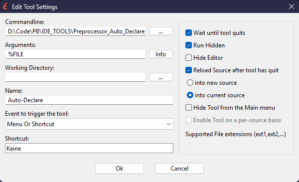

# LoTeK PureBasic PreProcessor AutoDeclare

AutoDeclare synchronizes `Declare` statements with existing `Procedure` definitions in a PureBasic `.pb` source file.


## Overview

AutoDeclare scans one source file, detects procedures and declarations, compares them by scope and type, removes invalid declarations, and generates missing valid ones.

The tool is intended for PureBasic projects that use:
- global procedures
- `DeclareModule`
- `Module`
- `CompilerIf #PB_Compiler_IsMainFile`

The processed file is overwritten in place.

This project was developed with the assistance of AI tools for research, coding support, and documentation.

## Releases

### Windows x64

A precompiled **Windows x64** build is available in the **Releases** section.

- File: `LoTeK_PureBasic_PreProcessor_AutoDeclare_Win64_v0.3.0.exe`
- Platform: Windows 64-bit
- Built with: PureBasic 6.30

If you do not want to compile the tool yourself, you can download the ready-to-use executable from the latest release.

**Download:** [LoTeK_PureBasic_PreProcessor_AutoDeclare_Win64_v0.3.0.exe](https://github.com/LoTeK-Zone/purebasic-module-preprocessor-autodeclare/releases/download/v0.3.0/LoTeK_PureBasic_PreProcessor_AutoDeclare_Win64_v0.3.0.exe)

## Features

- generates missing declarations
- removes obsolete declarations
- removes duplicate declarations
- validates typed declarations
- supports `DeclareModule`
- supports `Module`
- supports compiler scope
- processes one file at a time

## Technical Notes

### Scope Model

Recognized scopes:
- Global
- `DeclareModule`
- `Module`
- `CompilerIf #PB_Compiler_IsMainFile`

Everything outside these blocks is treated as global file scope.

`DeclareModule` has priority over matching `Module` declarations when such a `DeclareModule` declaration already exists.

### Processing Rules

AutoDeclare compares declarations and procedures by:
- name
- module
- scope
- type signature

The tool:
1. removes wrong declarations
2. removes obsolete declarations
3. removes duplicates
4. inserts missing valid declarations

It does not perform general refactoring.

### Supported

- PureBasic `.pb` source files
- global declarations and procedures
- `DeclareModule`
- `Module`
- multiple modules in one file
- `CompilerIf #PB_Compiler_IsMainFile`
- typed declarations

### Not Supported

- cross-file analysis
- `XIncludeFile` dependency tracking
- project-wide scanning
- DLL import declaration management
- full semantic parsing beyond declaration synchronization

### Notes

The tool inserts detected `Declare` statements at a sensible default location:
- in the global scope at the top of the file
- inside `DeclareModule`, `Module`, or `CompilerIf #PB_Compiler_IsMainFile` blocks at the top of these sections
- after `EnableExplicit`, if present

Depending on the project structure, it may still be necessary to move generated `Declare` lines manually afterwards, for example below structure definitions, constants, prototypes, or other project-specific declaration sections.

## Installation

<details>
<summary>PureBasic IDE</summary>

Add the executable as a Custom Tool in the PureBasic IDE.

Parameters: `%FILE`



</details>

## Usage

Run the tool with a `.pb` file path as parameter.

Typical workflow:
1. pass a source file to the tool
2. declarations are analyzed against procedures
3. invalid declarations are removed
4. missing declarations are generated
5. the file is overwritten

For manual testing, see:
- `tests/TestFile.pb`

## Repository Structure

<details>
<summary>Show repository structure</summary>

```text
purebasic-module-preprocessor-autodeclare
├── assets
│     └── img
│           └── Installation_PB_IDE_Screenshot_1.png
├── src
│     └── Mod_AutoDeclare.pb
├── tests
│     └── TestFile.pb
├── AGENTS.md
├── CHANGELOG.md
├── LICENSE
└── README.md
```

</details>

## Safety Notice

- the original file is overwritten
- no automatic backup is created
- use version control before running it on important files

## License

MIT License

See `LICENSE`.